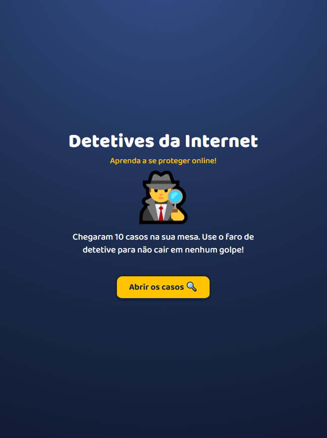
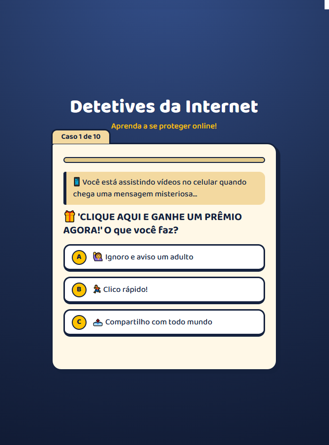
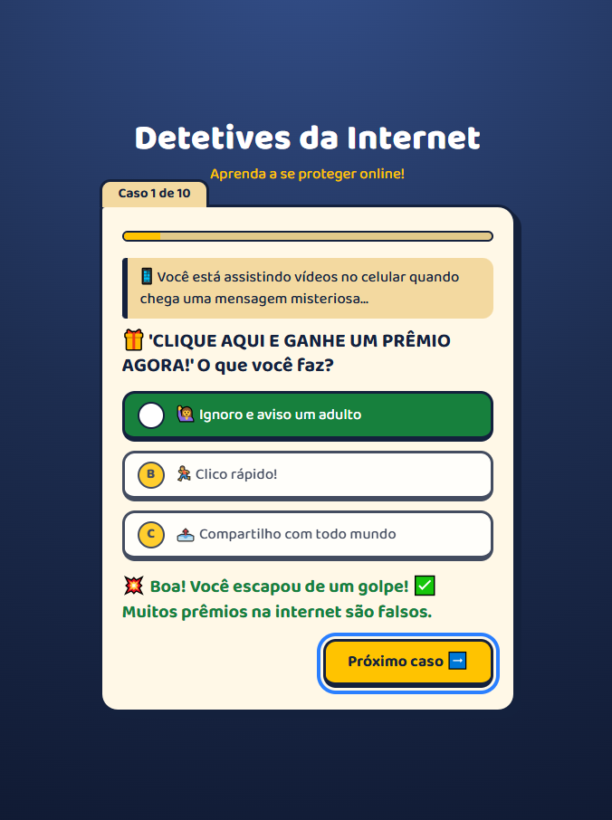
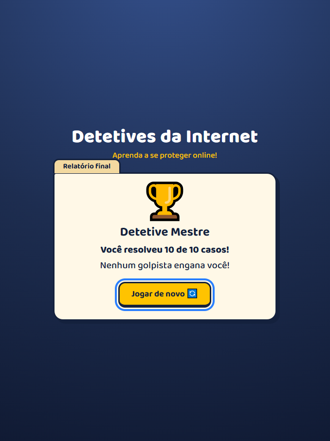

# 🕵️‍♂️ Detetives da Internet

Quiz interativo para crianças aprenderem a se proteger de golpes e riscos online. São 10 "casos" do dia a dia, como links suspeitos, pedidos de código, Pix e desconhecidos nas redes, com feedback imediato e uma explicação curta a cada resposta.


### 👉 [Jogar agora](https://raina-santana.github.io/mini-game/)

<p align="center">
  
  
  
  
</p>

## Sobre o projeto

Criei o projeto para praticar JavaScript puro com um tema que importa: segurança digital para crianças. Cada pergunta vem com uma historinha curta, o que ajuda a criança a reconhecer situações reais, e termina com uma "patente" de detetive de acordo com a pontuação.

## Funcionalidades

- 10 casos com historinha, alternativas e explicação do porquê da resposta certa
- Alternativas embaralhadas a cada partida, para não decorar a posição
- Barra de progresso, contador de casos e pontuação final
- Patentes: Detetive Mestre, Esperto ou Aprendiz
- Botão de jogar de novo, sem recarregar a página
- Layout responsivo, testado no celular e no notebook
- Animações de acerto e erro, desligadas automaticamente para quem usa `prefers-reduced-motion`

## Acessibilidade

- Feedback anunciado por leitores de tela (`aria-live`)
- Foco visível e navegação completa pelo teclado
- Alvos de toque grandes e contraste de cores revisado

## Tecnologias

- **HTML5** semântico
- **CSS3** com variáveis, Grid, Flexbox e animações
- **JavaScript** (ES6+), sem frameworks ou bibliotecas
- Fonte [Baloo 2](https://fonts.google.com/specimen/Baloo+2) (Google Fonts)

## Como rodar localmente

```bash
git clone https://github.com/raina-santana/mini-game.git
cd mini-game
```

Abra o `index.html` no navegador. Não precisa instalar nada.

## Estrutura

```
mini-game/
├── index.html   # estrutura da página
├── style.css    # visual e responsividade
├── script.js    # perguntas, lógica e pontuação
└── docs/        # capturas de tela usadas neste README
    ├── screenshot01.png
    ├── screenshot02.png
    ├── screenshot03.png
    └── screenshot04.png
```

## O que aprendi

- Organizar o fluxo de um quiz com estado simples (`current`, `score`) sem frameworks
- Embaralhar listas com o algoritmo Fisher-Yates
- Construir um layout responsivo e acessível, pensando no público infantil
- Usar Git e GitHub no dia a dia: branches, commits, pull requests e merge
- Lidar com cache do navegador ao publicar atualizações

## Próximos passos

- [ ] Sortear 10 perguntas de um banco maior
- [ ] Efeitos sonoros de acerto e erro
- [ ] Salvar a melhor pontuação no `localStorage`
- [ ] Modo com tempo limite por pergunta

## Autoria

Feito por **Rainã Santana**, estudante de Análise e Desenvolvimento de Sistemas, em busca de oportunidade como desenvolvedor front-end.

- GitHub: [@raina-santana](https://github.com/raina-santana)
- Portfólio: https://raina-santana.github.io/portifolio/
- LinkedIn: www.linkedin.com/in/rainasantana
